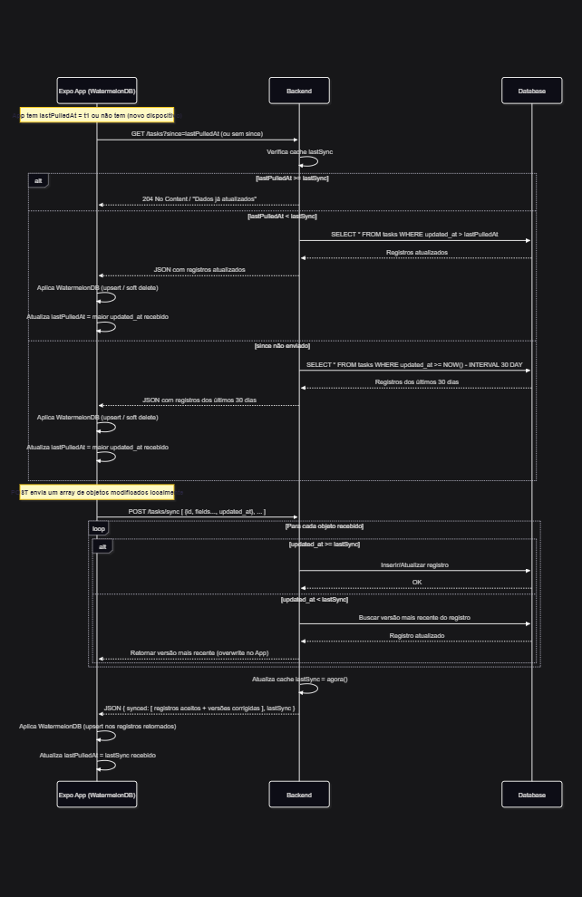
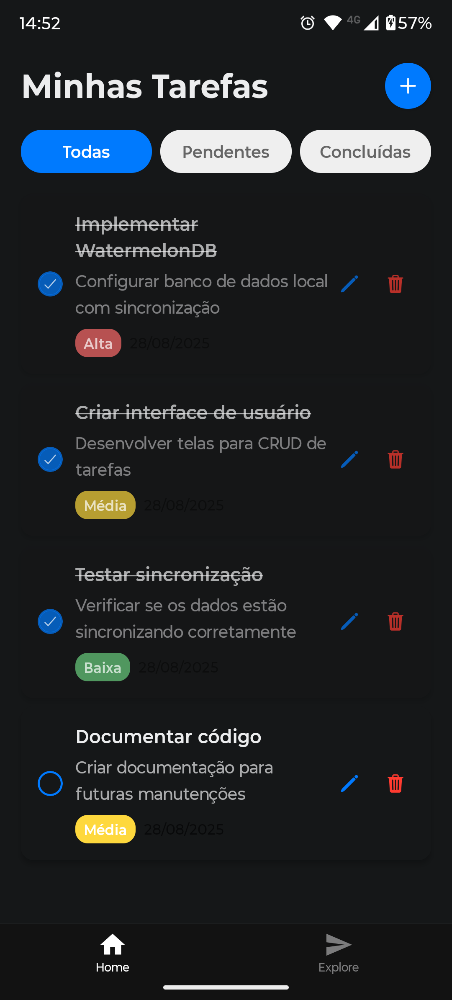

# Projeto de Estudos: Offline-First com Expo, WatermelonDB e JSON Server

Este projeto é um estudo prático sobre a implementação de aplicações **offline-first** utilizando [Expo](https://expo.dev), [WatermelonDB](https://watermelondb.dev/) e um backend simulado com [JSON Server](https://github.com/typicode/json-server). O objetivo é demonstrar, de ponta a ponta, como funciona o fluxo de sincronização entre um app mobile e um backend, de forma robusta e próxima ao cenário real de produção.

> **Nota:** Apesar de utilizar o JSON Server para simular o backend, todo o fluxo foi pensado para ser facilmente adaptado a qualquer backend real e banco de dados relacional, bastando implementar as rotas e regras de sincronização conforme o diagrama.

## Funcionalidades

- CRUD de tarefas com prioridade, descrição e data
- Sincronização bidirecional (pull/push) entre app e backend
- Suporte a uso offline e resolução de conflitos
- Interface moderna e responsiva

## Fluxo de Sincronização

O app utiliza o WatermelonDB para persistência local e sincronização eficiente. O fluxo segue o padrão:

1. **Pull:** O app busca do backend apenas os registros alterados desde a última sincronização (`lastPulledAt`).
2. **Push:** O app envia ao backend as alterações feitas localmente desde o último sync.
3. O backend responde com os dados aceitos e, se necessário, corrige conflitos devolvendo a versão mais recente do registro.
4. O app aplica as atualizações localmente e atualiza o timestamp de sincronização.

Veja o diagrama completo do fluxo:



## Telas do App

Veja abaixo a tela inicial do app:



## Como rodar o projeto

1. Instale as dependências:

   ```bash
   npm install
   ```

2. Gere as pastas nativas (prebuild):

   ```bash
   npx expo prebuild
   ```

3. Rode o app no Android:

   ```bash
   npx expo run:android
   ```

   > Para iOS, utilize `npx expo run:ios` (em um Mac).

Você também pode iniciar o Metro bundler com:

```bash
npx expo start
```

O backend simulado (JSON Server) pode ser iniciado com:

```bash
npm run server
```

## Referências e Recursos

- [Documentação do Expo](https://docs.expo.dev/)
- [WatermelonDB](https://watermelondb.dev/)
- [JSON Server](https://github.com/typicode/json-server)
- [Diagrama de Sincronização (ver imagem)](./assets/readme/diagram.png)
- [Tela Inicial do App (ver imagem)](./assets/readme/home.png)

## Sobre

Este projeto foi criado para fins didáticos, servindo como base para quem deseja entender e implementar sincronização offline-first em apps mobile, com backend customizável e fluxo realista de dados.
